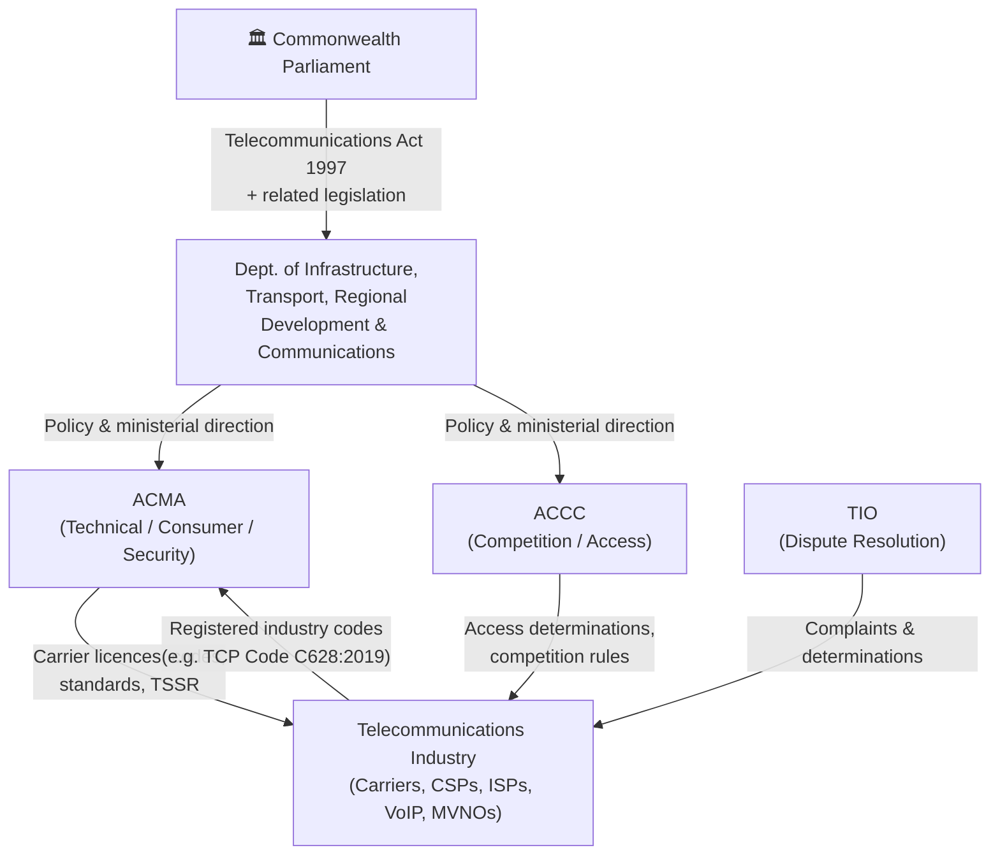
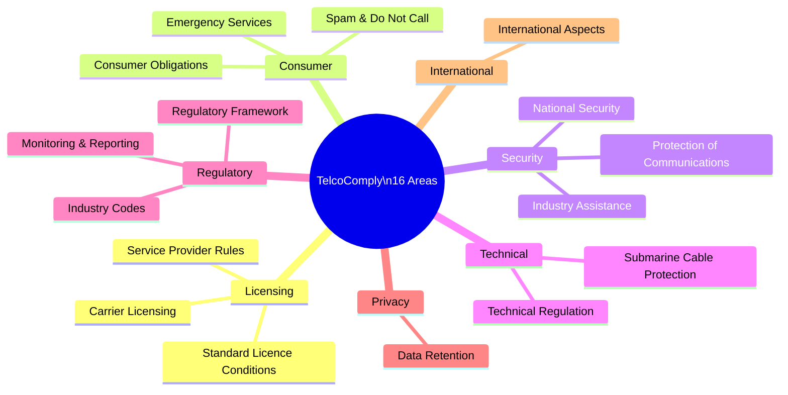
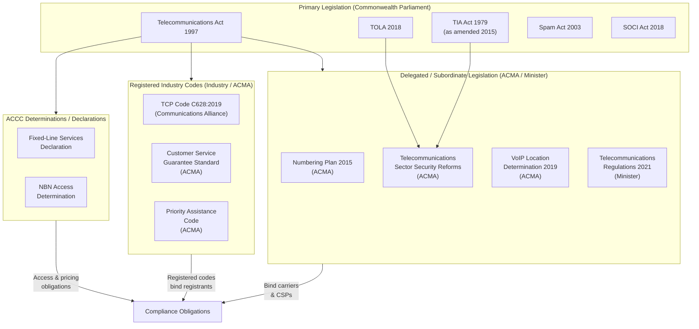
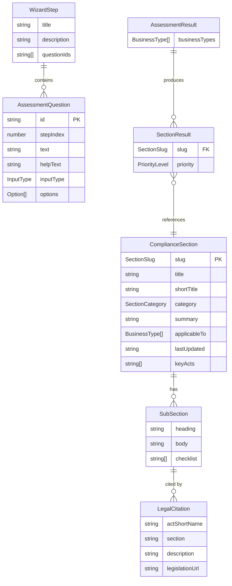
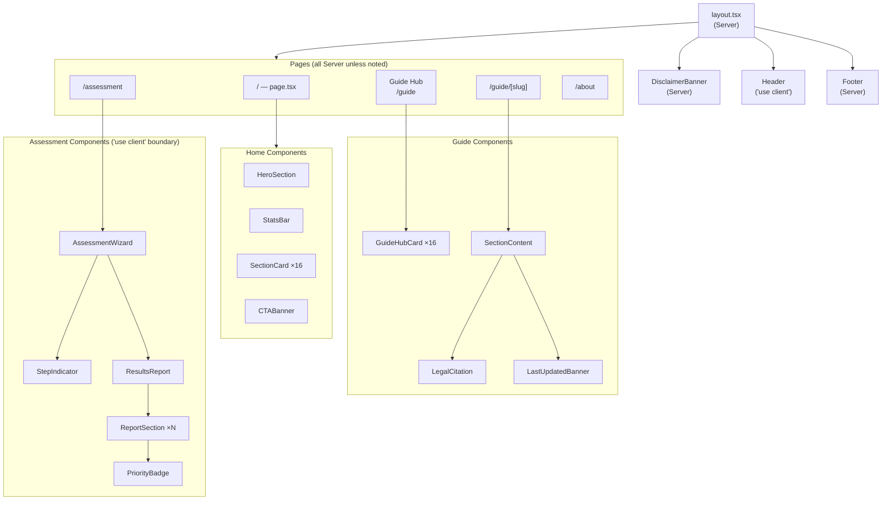
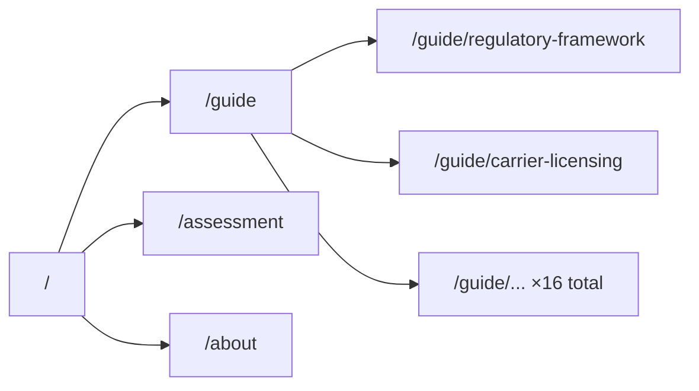
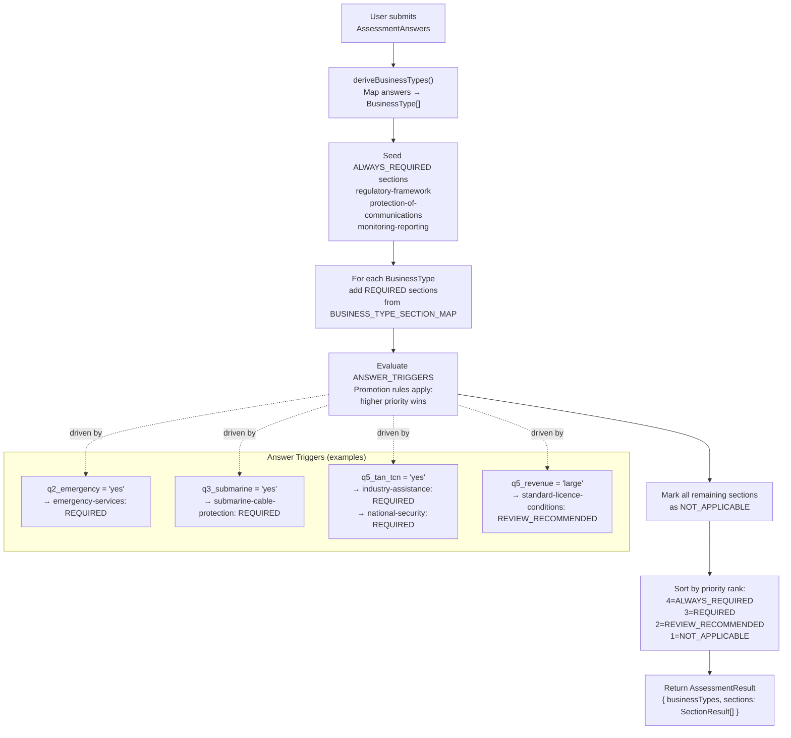
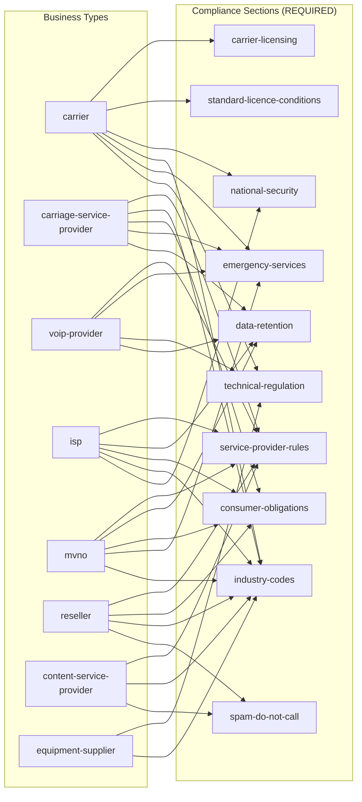

# TelcoComply

**Australian Telecommunications Act Compliance, Simplified.**

A comprehensive, open-source compliance reference tool for Australian telecommunications businesses — carriers, carriage service providers, ISPs, VoIP providers, MVNOs, resellers, and equipment suppliers. Built with Next.js 16, TypeScript, and Tailwind CSS v4. Fully static — no database, no authentication.

> **Legal Disclaimer:** TelcoComply is an informational reference tool only. Nothing in this application constitutes legal advice. Telecommunications compliance is a complex area of law; always consult a qualified Australian telecommunications lawyer before making compliance decisions.

---

## Table of Contents

1. [Legal Framework](#1-legal-framework)
   - [Regulatory Bodies](#11-regulatory-bodies)
   - [Primary Legislation](#12-primary-legislation)
   - [The 16 Compliance Areas](#13-the-16-compliance-areas)
   - [Business Type Classification](#14-business-type-classification)
   - [Regulatory Hierarchy](#15-regulatory-hierarchy)
2. [Application Architecture](#2-application-architecture)
   - [Tech Stack](#21-tech-stack)
   - [Project Structure](#22-project-structure)
   - [Data Model](#23-data-model)
   - [Component Hierarchy](#24-component-hierarchy)
   - [Routing](#25-routing)
3. [Assessment Engine](#3-assessment-engine)
   - [Wizard Steps](#31-wizard-steps)
   - [Scoring Logic](#32-scoring-logic)
   - [Priority Levels](#33-priority-levels)
4. [Development](#4-development)
5. [Deployment](#5-deployment)
6. [Content Currency](#6-content-currency)

---

## 1. Legal Framework

### 1.1 Regulatory Bodies

The Australian telecommunications sector is regulated by two principal Commonwealth agencies, plus an industry-based dispute resolution body:

| Body | Full Name | Primary Role | Website |
|------|-----------|-------------|---------|
| **ACMA** | Australian Communications and Media Authority | Technical standards, spectrum licensing, consumer protection, carrier licence administration, TSSR enforcement | [acma.gov.au](https://www.acma.gov.au) |
| **ACCC** | Australian Competition and Consumer Commission | Competition regulation, access determinations, NBN monitoring, anti-competitive conduct under CCA Part XIB | [accc.gov.au](https://www.accc.gov.au) |
| **TIO** | Telecommunications Industry Ombudsman | Independent dispute resolution for residential and small business complaints | [tio.com.au](https://www.tio.com.au) |



### 1.2 Primary Legislation

TelcoComply covers obligations arising from the following Commonwealth legislation:

| Act | Short Name | Key Subject Matter |
|-----|-----------|-------------------|
| [Telecommunications Act 1997 (Cth)](https://www.legislation.gov.au/C2004A05145) | Telco Act | Carrier licensing, service provider rules, consumer protections, emergency services, ACMA powers, infrastructure access |
| [Telecommunications (Interception and Access) Act 1979 (Cth)](https://www.legislation.gov.au/C2004A01667) | TIA Act | Lawful interception, stored communications access, data retention obligations (Part 5-1A, inserted 2015) |
| [Telecommunications (Consumer Protection and Service Standards) Act 1999 (Cth)](https://www.tcpss-act.link) | TCPSS Act | Universal service obligation, customer service guarantee, priority assistance |
| [Telecommunications and Other Legislation Amendment (Assistance and Access) Act 2018 (Cth)](https://www.legislation.gov.au/C2018A00148) | TOLA 2018 | Three-tier industry assistance framework (TAR, TAN, TCN) for law enforcement technical capability |
| [Spam Act 2003 (Cth)](https://www.legislation.gov.au/C2004A01214) | Spam Act | Prohibition on unsolicited commercial electronic messages; consent, identification, and unsubscribe requirements |
| [Do Not Call Register Act 2006 (Cth)](https://www.legislation.gov.au/C2006A00052) | DNCR Act | Prohibition on telemarketing calls to registered numbers |
| [Criminal Code Act 1995 (Cth)](https://www.legislation.gov.au/C2004A04868) | Criminal Code | Computer offences; Part 5.6 serious telecommunications offences |
| [Radiocommunications Act 1992 (Cth)](https://www.legislation.gov.au/C2004A04465) | Radcomms Act | Spectrum licensing, apparatus licences, interference obligations |
| [Security of Critical Infrastructure Act 2018 (Cth)](https://www.legislation.gov.au/C2018A00030) | SOCI Act | Critical infrastructure risk management; telecoms as a critical infrastructure sector |
| [Privacy Act 1988 (Cth)](https://www.legislation.gov.au/C2004A03712) | Privacy Act | Australian Privacy Principles (APPs); interfaces with data retention and marketing obligations |

### 1.3 The 16 Compliance Areas



| # | Slug | Title | Category | Key Legislation |
|---|------|-------|----------|----------------|
| 1 | `regulatory-framework` | Regulatory Framework & ACMA Powers | Regulatory | Telco Act Parts 1–2; ACMA Act 2005 |
| 2 | `carrier-licensing` | Carrier Licensing | Licensing | Telco Act Part 3 Div 2; ss 42–56 |
| 3 | `service-provider-rules` | Carriage Service Provider Rules | Licensing | Telco Act Part 4; ss 87–101 |
| 4 | `industry-codes` | Industry Codes & Standards | Regulatory | Telco Act Part 6; TCP Code C628:2019 |
| 5 | `protection-of-communications` | Protection of Communications | Security | Telco Act Part 13; ss 276–310 |
| 6 | `emergency-services` | Emergency Services | Consumer | Telco Act s 147; ACMA 2019 Determination |
| 7 | `monitoring-reporting` | Monitoring & Compliance Reporting | Regulatory | Telco Act Part 26; Schedule 1 |
| 8 | `technical-regulation` | Technical Regulation & Equipment | Technical | Telco (Customer Equipment) Act 2000; RCM; Numbering Plan 2015 |
| 9 | `international-aspects` | International Aspects | International | Telco Act s 10; ITU Radio Regulations |
| 10 | `national-security` | National Security Obligations | Security | Telco Act Part 14; SOCI Act 2018; TSSR |
| 11 | `industry-assistance` | Industry Assistance (TOLA) | Security | TOLA 2018; TAR / TAN / TCN framework |
| 12 | `standard-licence-conditions` | Standard Licence Conditions | Licensing | Telco Act Schedule 1; Facilities Access Code |
| 13 | `submarine-cable-protection` | Submarine Cable Protection | Technical | Telco Act Part 3.5A; ss 99A–99H |
| 14 | `data-retention` | Data Retention | Privacy | TIA Act Part 5-1A (as amended 2015); 39 data categories |
| 15 | `consumer-obligations` | Consumer Obligations | Consumer | TCP Code C628:2019; TCPSS Act 1999; TIO |
| 16 | `spam-do-not-call` | Spam & Do Not Call | Consumer | Spam Act 2003; DNCR Act 2006; Privacy Act APPs |

### 1.4 Business Type Classification

The assessment engine classifies businesses into one or more of eight types derived from the Telecommunications Act's definitional framework:

| Business Type | Legal Basis | Description |
|---------------|------------|-------------|
| `carrier` | Telco Act s 7 "carrier", s 42 | Holds or intends to hold a carrier licence; owns network units used to supply carriage services |
| `carriage-service-provider` | Telco Act s 87 "CSP" | Supplies carriage services using a carrier's network; does not need a carrier licence but must comply with Part 4 |
| `content-service-provider` | Telco Act s 15 "content service" | Supplies content (information, entertainment) delivered over a carriage service |
| `voip-provider` | Telco Act; ACMA VoIP determinations | Supplies Voice over IP services; special obligations re 000 location data and CLI |
| `equipment-supplier` | Telco (Customer Equipment) Act 2000 | Supplies or installs customer equipment; RCM marking and cabling provider rules apply |
| `reseller` | Telco Act Part 4 | Resells a carriage service acquired wholesale; obligations flow through supply chain |
| `isp` | Telco Act Part 4; TIA Act Part 5-1A | Provides internet access; data retention obligations apply under TIA Act |
| `mvno` | Telco Act Part 4 | Mobile Virtual Network Operator; uses a carrier's mobile network infrastructure |

### 1.5 Regulatory Hierarchy



---

## 2. Application Architecture

### 2.1 Tech Stack

| Layer | Technology | Version | Purpose |
|-------|-----------|---------|---------|
| Framework | [Next.js](https://nextjs.org) | 16.0.3 | App Router, SSG, file-based routing |
| Language | TypeScript | 5.x | Strict typing throughout |
| Styling | Tailwind CSS v4 | 4.x | Utility-first; theme tokens in `globals.css` |
| UI Icons | [Lucide React](https://lucide.dev) | 0.554.0 | SVG icon library |
| Animations | [Framer Motion](https://www.framer.com/motion/) | 12.x | Card hover effects |
| Form State | [React Hook Form](https://react-hook-form.com) | 7.x | Assessment wizard state |
| Validation | [Zod](https://zod.dev) | 4.x | Per-step answer validation |
| Variant Styling | [class-variance-authority](https://cva.style) | 0.7.x | Button / Badge CVA variants |
| CSS Utilities | clsx + tailwind-merge | latest | Conditional class merging |
| Runtime | Node.js | 20+ | Build-time only; output is static HTML |

> **No database. No authentication. No environment variables required.** All content is compiled to static HTML/JS at build time.

### 2.2 Project Structure

```
telcom_compliance/
├── public/
│   ├── favicon.svg          # 32×32 navy rounded-rect with "TC" mark
│   ├── logo.svg             # 220×44 TelcoComply wordmark + antenna icon
│   └── manifest.json        # PWA manifest (standalone, theme #1B3A6B)
│
├── src/
│   ├── types/
│   │   └── compliance.ts    # All TypeScript interfaces & union types
│   │
│   ├── data/
│   │   ├── sections.ts      # 16 ComplianceSection objects (legal content + citations)
│   │   └── assessmentQuestions.ts  # 5 WizardStep + 12 AssessmentQuestion objects
│   │
│   ├── lib/
│   │   ├── assessment.ts    # scoreAssessment() — maps answers → SectionResult[]
│   │   └── utils.ts         # cn() — clsx + tailwind-merge helper
│   │
│   ├── app/                 # Next.js App Router
│   │   ├── layout.tsx       # Root layout: Inter font, metadata, Header + Footer
│   │   ├── globals.css      # Tailwind v4 @theme inline {} design tokens
│   │   ├── page.tsx         # / — Home
│   │   ├── about/
│   │   │   └── page.tsx     # /about
│   │   ├── assessment/
│   │   │   └── page.tsx     # /assessment — wraps <AssessmentWizard />
│   │   └── guide/
│   │       ├── page.tsx     # /guide — hub with all 16 section cards
│   │       └── [slug]/
│   │           └── page.tsx # /guide/[slug] — 16 static detail pages
│   │
│   └── components/
│       ├── ui/              # Primitive design system components
│       │   ├── Button.tsx   # CVA variants: primary | secondary | ghost | destructive
│       │   ├── Card.tsx     # Card, CardHeader, CardContent, CardFooter
│       │   ├── Badge.tsx    # CVA variants for category + priority labels
│       │   └── Divider.tsx  # Optional labelled horizontal rule
│       │
│       ├── layout/          # App shell
│       │   ├── Header.tsx   # Sticky nav ('use client') — hamburger on mobile
│       │   ├── Footer.tsx   # Navy footer with regulatory resource links
│       │   └── DisclaimerBanner.tsx  # Amber "not legal advice" banner
│       │
│       ├── home/            # Landing page sections (all server components)
│       │   ├── HeroSection.tsx
│       │   ├── StatsBar.tsx
│       │   ├── SectionCard.tsx
│       │   └── CTABanner.tsx
│       │
│       ├── guide/           # Compliance guide components (all server components)
│       │   ├── GuideHubCard.tsx
│       │   ├── SectionContent.tsx   # Renders subsections[], checklists, citations
│       │   ├── LegalCitation.tsx    # Styled citation block → legislation.gov.au
│       │   └── LastUpdatedBanner.tsx
│       │
│       └── assessment/      # Wizard components
│           ├── AssessmentWizard.tsx  # 'use client' — all wizard state lives here
│           ├── StepIndicator.tsx
│           ├── ResultsReport.tsx
│           ├── ReportSection.tsx
│           └── PriorityBadge.tsx
```

### 2.3 Data Model



### 2.4 Component Hierarchy



### 2.5 Routing

All 23 pages are statically generated at build time (`output: 'static'` compatible). No server-side rendering or dynamic routes that require a runtime.



| Route | File | Render Strategy | Notes |
|-------|------|----------------|-------|
| `/` | `src/app/page.tsx` | Static | Home with 16 section cards |
| `/guide` | `src/app/guide/page.tsx` | Static | Hub grid of all sections |
| `/guide/[slug]` | `src/app/guide/[slug]/page.tsx` | Static (×16) | `generateStaticParams()` exports all 16 slugs |
| `/assessment` | `src/app/assessment/page.tsx` | Static shell | Client component for interactivity |
| `/about` | `src/app/about/page.tsx` | Static | Disclaimer, scope, currency notice |

---

## 3. Assessment Engine

### 3.1 Wizard Steps

The assessment wizard collects answers across five steps to determine which compliance areas apply to the user's business:

| Step | Title | Questions Covered |
|------|-------|------------------|
| 1 | Business Structure | Network ownership; carrier licence intent |
| 2 | Services Provided | Fixed voice, mobile, broadband, VoIP, SMS/messaging, wholesale, content; 000 access; international operations |
| 3 | Infrastructure & Equipment | Owns network infrastructure; supplies/installs customer equipment; submarine cable ownership |
| 4 | Data & Privacy | Metadata retention obligations; email/SMS marketing; outbound telemarketing |
| 5 | Security & Law Enforcement | Received TAN or TCN under TOLA 2018; lawful interception obligations; annual revenue band |

### 3.2 Scoring Logic



#### Business Type → Section Mapping



### 3.3 Priority Levels

| Priority | Colour | Meaning |
|----------|--------|---------|
| `ALWAYS_REQUIRED` | Navy | Applies to every telecommunications participant without exception |
| `REQUIRED` | Teal | Applies based on business type or a specific answer trigger |
| `REVIEW_RECOMMENDED` | Amber | Likely relevant; professional review advised (e.g. revenue thresholds approaching SLSO) |
| `NOT_APPLICABLE` | Grey | No indicators found; shown greyed out at the bottom of results |

---

## 4. Development

### Prerequisites

- Node.js 20+
- npm 10+

### Setup

```bash
git clone https://github.com/JohnJohnW/telcom_compliance.git
cd telcom_compliance
npm install
npm run dev
```

Open [http://localhost:3000](http://localhost:3000).

### Available Scripts

| Script | Command | Description |
|--------|---------|-------------|
| Dev server | `npm run dev` | Starts Next.js with Turbopack at localhost:3000 |
| Production build | `npm run build` | Compiles and statically generates all 23 pages |
| Start production | `npm run start` | Serves the production build locally |
| Lint | `npm run lint` | ESLint with `eslint-config-next` |

### Design System

All theme tokens live in `src/app/globals.css` using Tailwind v4's `@theme inline {}` directive. There is **no** `tailwind.config.js`.

| Token | Value | Usage |
|-------|-------|-------|
| `--color-navy-900` | `#1B3A6B` | Primary — nav, headings, CTA buttons |
| `--color-navy-700` | `#254D8E` | Hover states |
| `--color-steel-600` | `#2E6BB5` | Accent — links, secondary buttons |
| `--color-steel-100` | `#EBF3FB` | Light blue tint backgrounds |
| `--color-teal-600` | `#0D9488` | Success — REQUIRED badges, checklists |
| `--color-teal-50` | `#F0FDFA` | Checklist item backgrounds |
| `--color-amber-500` | `#F59E0B` | REVIEW RECOMMENDED badges, disclaimer banner |
| `--color-slate-900` | `#0F172A` | Body text |
| `--color-slate-600` | `#475569` | Secondary text |
| `--color-slate-100` | `#F1F5F9` | Page background, card borders |

### Adding or Updating Legal Content

All legal content is in `src/data/sections.ts`. Each `ComplianceSection` has:

```typescript
{
  slug: 'carrier-licensing',        // matches the URL slug
  title: '...',
  category: 'Licensing',
  summary: '...',                   // shown on cards
  applicableTo: ['carrier'],        // BusinessType[]
  lastUpdated: '2026-02-01',        // ISO date
  keyActs: ['Telecommunications Act 1997 (Cth)'],
  subsections: [
    {
      heading: '...',
      body: '...',
      checklist: ['Obligation 1', 'Obligation 2'],
      citations: [
        {
          actShortName: 'Telecommunications Act 1997',
          section: 's 42',
          description: '...',
          legislationUrl: 'https://www.legislation.gov.au/C2004A05145',
        }
      ]
    }
  ]
}
```

**Always cite to [legislation.gov.au](https://www.legislation.gov.au)** — not AustLII (a third-party mirror). Use the `legislation.gov.au` permanent identifier URL for the Act, not a specific section URL (section numbers change with amendments).

---

## 5. Deployment

### Vercel (Recommended)

1. Import `https://github.com/JohnJohnW/telcom_compliance` into [Vercel](https://vercel.com)
2. Framework preset: **Next.js** (auto-detected)
3. Root directory: `/` (no monorepo subdirectory needed)
4. No environment variables required
5. Deploy

The build output is fully static — Vercel's Edge Network will serve all 23 pages from cache globally.

### Build Output

```
Route (app)                         Size    First Load JS
┌ ○ /                              ...
├ ○ /about                         ...
├ ○ /assessment                    ...
├ ○ /guide                         ...
└ ○ /guide/[slug] ×16              ...

○  (Static)  prerendered as static content
```

All routes are `○ Static` — zero server-side compute at runtime.

---

## 6. Content Currency

Legal content was last reviewed in **February 2026** and reflects the state of Australian telecommunications law as of that date.

| Area | Last Significant Change | Notes |
|------|------------------------|-------|
| Carrier Licensing | Ongoing | ACMA carrier licence register updated continuously |
| Data Retention | 2015 | TIA Amendment (Data Retention) Act 2015; no major amendments since |
| TOLA / Industry Assistance | 2018 | TOLA 2018 in force; INSLM reviews ongoing |
| TCP Code | 2019 | C628:2019 is the current registered version |
| SOCI / TSSR | 2021–2023 | SOCI Act amended 2021 (SLACIP Act); TSSR reforms 2021 |
| Spam Act Penalties | 2023 | Penalty unit increases apply |
| VoIP Location Obligations | 2019 | ACMA determination; reviewed periodically |

> **Content updates:** Telecommunications law changes frequently via new regulations, ACMA determinations, and instrument amendments. Sections are dated with `lastUpdated` — check the ACMA, ACCC, and legislation.gov.au for the most current position before relying on any content.

---

## Contributing

Contributions to improve legal accuracy, add new compliance areas, or fix outdated citations are welcome. Please open an issue before submitting a PR for substantive legal content changes, so the scope can be discussed.

---

## Licence

MIT — see [LICENSE](./LICENSE) for details. Legal content is provided for informational purposes only and does not constitute legal advice.
